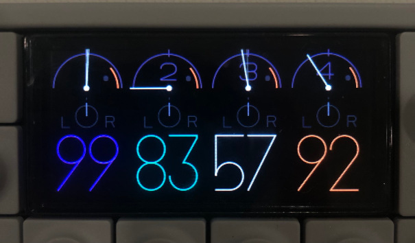

# op1-glitter

a color scheme modifier for the teenage engineering op-1 (original).

*there's no way to take screenshots on the OP-1, sorry for the picture quality LOL*

## requires

- python 3.10+
- op1repacker (installed through `pip` [`pip install op1repacker`])

## basic usage

before you do anything, it's recommended to back up your op-1 (just in case)! enter disk mode and copy everything to a folder on your computer.

1. clone this repository (`git clone https://github.com/nanobot567/op1-glitter`).

2. snag the latest op-1 original firmware package from [teenage engineering's website](https://teenage.engineering/downloads/op-1/original), and drop it in the same directory as op1-glitter.py.

3. locate the theme.json file you would like to apply (there are some examples in `examples/`!) and move it to the same folder.

4. run `python3 op1-glitter.py [.json file] [firmware file name]`.

5. your new firmware should be created! by default the new file name is `[original filename]-[theme name].op1`.

6. update to the new firmware on your op-1. to do this, enter te-boot (shut off your op-1, hold down the COM key while turning it back on), press 1 to enter firmware upgrade mode, and follow the instructions displayed on screen.

7. after your op-1 reboots, you should now have the new color theme!!

if your op-1 crashes, enter te-boot again and instead copy the original firmware to the firmware upload disk to revert.

## creating your own themes

if you would like to create your own color theme, check out the [theme creation guide](THEME_CREATION.md).

### disclaimer: i am not responsible for any damage that may be caused to your op-1! use at your own risk (although i have done thorough testing and have always been able to revert my firmware with no data loss when issues have occurred).
